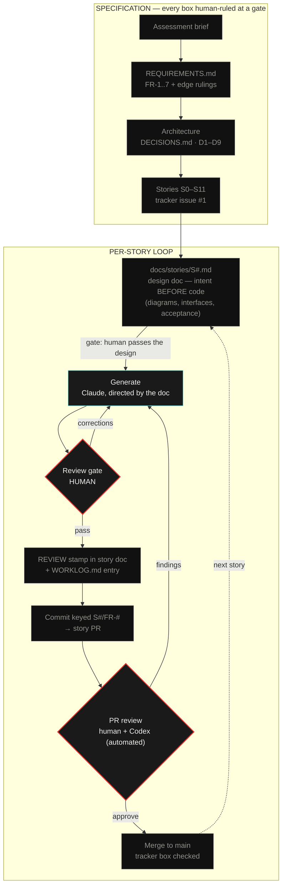

# SENTINEL ⬡

Map-based real-time data visualization — Dominion Dynamics technical assessment, Problem 1.

A live airspace console over the Ottawa sector: 100+ simulated assets, user-drawn
restricted zones with per-asset time-to-entry, an autonomous patrol drone that shadows
zone breachers, and multi-client sync over a server-authoritative WebSocket.

**Status: build in progress** — story tracker at [#1](https://github.com/ayfor/sentinel/issues/1).

## Quickstart

```bash
npm install
npm run dev        # server :3001 + client :5173
```

Open http://localhost:5173. Two tabs to see sync.

## The process — from requirements to PRs

This repo is built with a documented human-directed AI workflow. Every artifact
below exists in-tree; nothing is reconstructed after the fact.



Red-bordered nodes are human decision points; cyan is directed generation;
everything else is a committed artifact. Corrections flow backward — including
findings from the automated PR reviewer — and every cycle is recorded in the
worklog. This diagram is itself the process that produced this repository.

- **Specifications are the prompts.** The LLM builds from `REQUIREMENTS.md`, the
  per-story design docs, and explicit architecture rulings (`DECISIONS.md`) — not
  from ad-hoc instructions.
- **Nothing merges unreviewed.** Each story doc carries a human REVIEW stamp
  recording what was checked, corrected, or rejected at the gate.
- **The trail is auditable:** [`LLM.md`](LLM.md) (disclosure) ·
  [`docs/llm/WORKLOG.md`](docs/llm/WORKLOG.md) (live gate log) ·
  [`DECISIONS.md`](DECISIONS.md) (rulings) · story-keyed commit history.

## Design

The visual system ("instrumentation as draughtsmanship") was extracted from a
personally curated reference board via an AI vision pipeline, then human-ruled:
palette, layout, and six taste tensions resolved before the first line of code.
Interactive components carry a glass grammar adapted from my own prior design
system. Full rationale lands in `docs/DESIGN.md` at ship.

## Architecture (summary)

npm workspaces monorepo — `server/` (Fastify + ws: 1 Hz simulation core, all
derived truth computed server-side) · `client/` (Vite + React + TS + plain
Leaflet: rendering and gestures only) · `shared/types.ts` (the wire contract
both sides import). REST carries commands; the WebSocket carries state, one way.
Full tradeoffs in `DECISIONS.md`.
