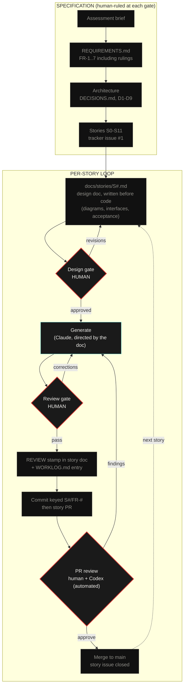
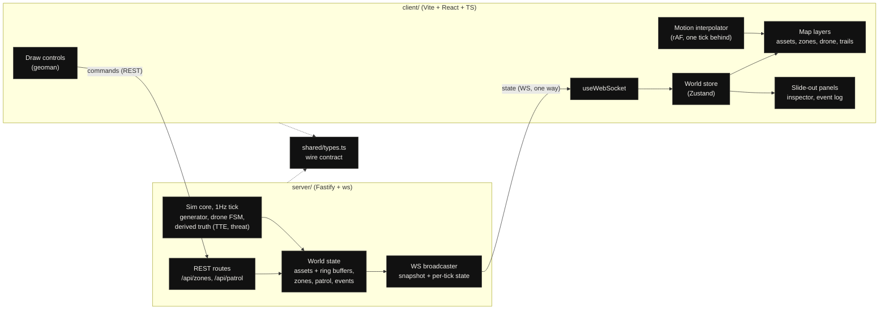

# SENTINEL ⬡

Map-based real-time data visualization. Dominion Dynamics technical assessment, Problem 1.

A live airspace console over the Ottawa sector which includes the following:
- 100+ simulated assets
- User-drawn restricted zones with per-asset time-to-entry
- An autonomous patrol drone that shadows zone breachers
- Multi-client sync over a server-authoritative WebSocket

Status: build in progress. Story tracker: [#1](https://github.com/ayfor/sentinel/issues/1).

## Quickstart

```bash
npm install
npm run dev        # server :3001, client :5173
```

Open http://localhost:5173. Open a second tab to see sync.

## Process

This project was built with a human-directed AI workflow. The process artifacts
are part of the repository and were written as the work was completed.



Red border marks a human decision point. Cyan marks directed generation. Grey
marks a committed artifact. Corrections flow backward, including findings from
the automated PR reviewer, and each cycle is recorded in the worklog.

Three rules govern the loop. The specifications are the prompts: generation
works from [`docs/REQUIREMENTS.md`](docs/REQUIREMENTS.md), the per-story design
docs, and the rulings in [`docs/DECISIONS.md`](docs/DECISIONS.md), not from
ad-hoc instructions. Nothing merges unreviewed: every story doc carries a REVIEW
stamp recording what was checked, corrected, or rejected, transcribed from
review comments on the story PR. The trail is auditable:
[`docs/LLM.md`](docs/LLM.md), [`docs/llm/WORKLOG.md`](docs/llm/WORKLOG.md), and
the story-keyed commit history.

## Design

The visual direction was extracted from a reference board I curate, using an AI
process to extract design patterns, taste and common elements of components.
From this extraction, there is a feedback loop with sample mockups to determine
and finalize design direction. As a starting point, interactive components use a
glass treatment adapted from my own prior design system. Non-interactive
surfaces stay flat to create a clear visual hierarchy for the user. Additional
details can be found in `docs/DESIGN.md`.

## Architecture

The architecture for this application is a straightforward mono repo that runs a
server broadcasting at a rate of 1Hz using Fastify. The backend computes the
state of data display (e.g., TTE, perimeter breach, threat status) and
broadcasts using Websockets to the client(s) so that clients remain lightweight
and in-sync across instances.

The client of the application consists of Vite, React, TypeScript and Leaflet.
The role of the client in this application is to render the backend-computed
state and accept gestures from the user.

Client commands (zone and patrol drawing) are sent via REST API. All state
flows back to clients over the WebSocket, one way.



This diagram is re-verified against each story design doc at its gate and
updated when a story changes the component picture.

Tradeoff assessments for these components and design decisions can be found in
[`docs/DECISIONS.md`](docs/DECISIONS.md)
