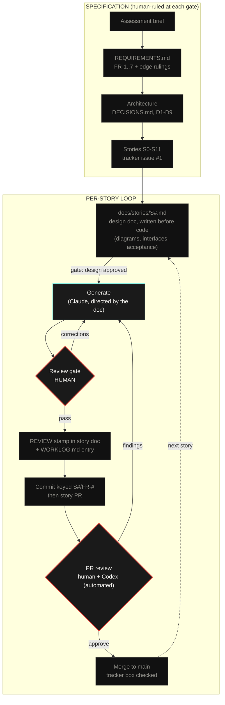

# SENTINEL ⬡

Map-based real-time data visualization. Dominion Dynamics technical assessment, Problem 1.

A live airspace console over the Ottawa sector: 100+ simulated assets, user-drawn
restricted zones with per-asset time-to-entry, an autonomous patrol drone that
shadows zone breachers, and multi-client sync over a server-authoritative WebSocket.

Status: build in progress. Story tracker: [#1](https://github.com/ayfor/sentinel/issues/1).

## Quickstart

```bash
npm install
npm run dev        # server :3001, client :5173
```

Open http://localhost:5173. Open a second tab to see sync.

## Process: from requirements to PRs

This project was built with a human-directed AI workflow. The process artifacts
are part of the repository and were written as the work happened.



Red border marks a human decision point. Cyan marks directed generation. Grey
marks a committed artifact. Corrections flow backward, including findings from
the automated PR reviewer, and each cycle is recorded in the worklog.

Three rules govern the loop. The specifications are the prompts: generation
works from [`REQUIREMENTS.md`](REQUIREMENTS.md), the per-story design docs, and
the rulings in [`DECISIONS.md`](DECISIONS.md), not from ad-hoc instructions.
Nothing merges unreviewed: every story doc carries a REVIEW stamp recording what
was checked, corrected, or rejected, transcribed from review comments on the
story PR. The trail is auditable:
[`LLM.md`](LLM.md), [`docs/llm/WORKLOG.md`](docs/llm/WORKLOG.md), and the
story-keyed commit history.

## Design

The visual direction was extracted from a reference board I curate, using an AI
vision pipeline, then ruled by hand: palette, layout, and six taste tensions
were resolved before the first line of code. Interactive components use a glass
treatment adapted from my own prior design system. Non-interactive surfaces stay
flat. Full rationale lands in `docs/DESIGN.md` at ship.

## Architecture

npm workspaces monorepo. `server/` runs the 1 Hz simulation core on Fastify and
computes all derived state (TTE, breach, threat) so clients never disagree.
`client/` is Vite, React, TypeScript, and plain Leaflet, responsible for
rendering and gestures only. `shared/types.ts` is the wire contract both sides
import. REST carries commands. The WebSocket carries state, one way. Tradeoffs
are recorded in [`DECISIONS.md`](DECISIONS.md).
