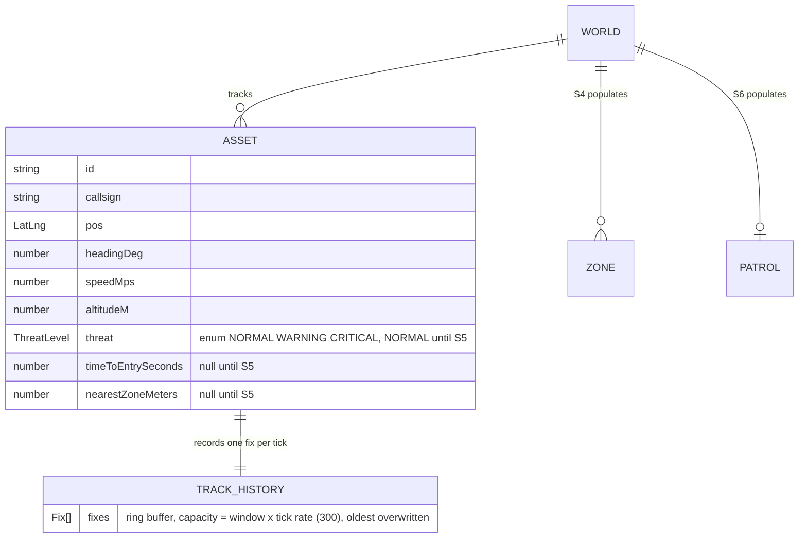
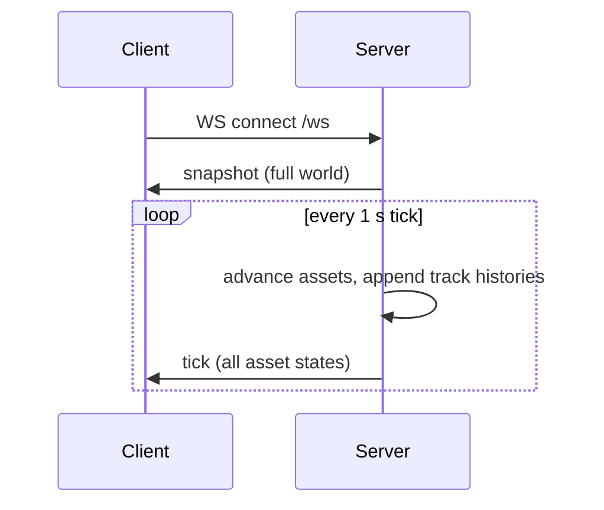

# S1 — World tick (FR-1)

Issue: #4. Closes via the story PR.

## Purpose

Stand up the living world: a generator maintaining 100+ assets, a 1 Hz simulation
tick, and the WebSocket protocol that carries the whole truth to every client
(i.e., after S1 the server is feature-shaped and the client is one story from
showing it).

## Design

- `server/src/world.ts` owns state: assets map, per-asset track history, zones,
  patrol, events. Plain data, no classes.
- `server/src/generator.ts` seeds 120 assets in a box around the Ottawa sector
  (e.g., realistic envelopes: 140-250 m/s, 6-12 km altitude) and applies small
  heading drift per tick. Airline-style callsigns (ACA/WJA/DAL/UAL-###).
- `server/src/tick.ts` runs the 1 Hz loop: advance positions by dead reckoning
  (bearing + speed over measured dt), append to track histories, then broadcast.
- Geometry helpers live in `shared/geo.ts` so S5 reuses identical math.
- `server/src/broadcast.ts` tracks connected sockets; snapshot on connect, full
  asset state every tick (D8); zones/patrol/drone/events only on change.
- `threat` is an enumerated state from day one: `NORMAL | WARNING | CRITICAL`
  (`ThreatLevel` union in `shared/types.ts`). S1 emits `NORMAL`; S5 computes the
  real value. The wire shape never migrates.
- `timeToEntrySeconds` (renamed from `tteS` for readability) ships as `null`
  until S5; `nearestZoneMeters` follows the same naming pattern.

## Interfaces

### Data Model

A track history is the asset's recorded flight track: a fixed-capacity ring
buffer of position fixes, one appended per tick. The vocabulary is deliberate
domain idiom: a fix is a determination of position at a moment (i.e., a position
fix, as in navigation and GPS), and a track is a time-ordered sequence of fixes,
which is how radar and surveillance systems describe exactly this structure. At capacity the oldest fix is
overwritten, so the buffer always holds the most recent 5 minutes. S7 reads it
for the faded trail; S5 reads it for the 5-minute average behind the predicted
path.

### Sequence Diagram - Connection Lifecycle

### Messages and Endpoints

| name | type | action | payload | description |
|---|---|---|---|---|
| `snapshot` | WebSocket | push, server to client | full world: assets, zones, patrol, drone, recent events | Sent once on connect or reconnect. |
| `tick` | WebSocket | push, server to client | all asset states + drone state | Sent every tick; the whole truth, every second (D8). |

S1 adds no REST endpoints. REST rows in future docs carry the HTTP verb in the
action column (e.g., POST, DELETE).

## Decisions

- Track histories record from boot, not from first selection: history must
  already exist when S7 asks for it. Capacity is derived, not chosen: the FR-4
  window (5 min) times the tick rate (1 Hz) gives 300 fixes; the code computes
  it from TICK_MS so a rate change cannot desync the window. Cost at 120 assets
  is roughly 0.9 MB of raw fixes (a few MB in heap terms), trivial server-side.
- Generator wander is bounded heading drift only (no altitude or speed drama);
  believable motion beats theatrical motion on a monitoring console.
- setInterval with dt measured per tick (not assumed 1000 ms) so drift under
  load does not accumulate position error.

## Acceptance

- 100+ assets exist with live position, heading, speed (FR-1).
- A WS client receives a snapshot on connect, then a tick within ~1 s.
- Positions advance consistently with each asset's heading and speed.
- Track histories hold up to 5 minutes per asset.
- Wire types compile from `shared/types.ts` on both sides.

## Review

### Round 1 - Design Gate, Operator Comments (Verbatim)

> - Clarify the role of Ring Buffers as they are defined in the ERD and their relationship to tracks. Add description to the diagram to elaborate
> - Add a separate heading to separate tables and diagrams. Use headers instead of bold for sections including future docs
> - Clarify THREAT as an enum or similar to denote how states will be recorded in the future. Its trivial enough to tackle now instead of in a future Story.
> - tteS prop name should be more verbose for readability
> - Endpoint table should have "direction" changed to "type" if we are going to deliniate between REST and Websocker. Those should be the type options. In the REST case, there should be a column specifying the action (e.g, PUT, POST)

### Disposition

All five applied: TRACK_HISTORY entity with attributes and prose elaboration;
markdown headers with diagram/table subheadings (standing convention); ThreatLevel
documented as the enumerated state union in `shared/types.ts` now; `tteS` renamed
`timeToEntrySeconds` (and `nearestZoneM` renamed `nearestZoneMeters` by the same
pattern); interface table rekeyed to name, type (REST | WebSocket), action, payload,
description (standing convention).

### Round 2 - Design Gate Stamp (Verbatim)

> Approved, proceed with S1

### Round 3 - PR Window, Operator Questions (Verbatim)

> One thing that came to mind, why 300 for track_history?

> why is the log called "fix"?

> nope thats fine. Worth recording in the design doc. Also, why is there a String span with 5 min at 1 Hz?

### Disposition (Round 3)

- Why 300: the number is derived, not chosen (FR-4's 5-minute window at the 1 Hz
  tick rate). The question exposed a magic number and an understated memory
  estimate; HISTORY_CAPACITY now computes from HISTORY_WINDOW_S and TICK_MS in
  code, and the doc records the derivation with the corrected ~0.9 MB raw cost.
- Why "fix": navigation domain idiom (a position fix; a track is a time-ordered
  sequence of fixes). Ruled kept; rationale recorded in the Data Model prose.
- String span: the question caught two fabricated ERD pseudo-columns (policy,
  span) that existed only to carry annotations and matched nothing at runtime.
  Removed; the annotation now lives on the one real field and the prose.

### Round 4 - PR Review Comments (Verbatim)

> Prefer to use const instead of redeclaring 360 value

Disposition: FULL_CIRCLE_DEG exported from shared/geo.ts, used in
normalizeBearing and the generator's heading spawn.

PR gate: pending operator merge of PR #15.
