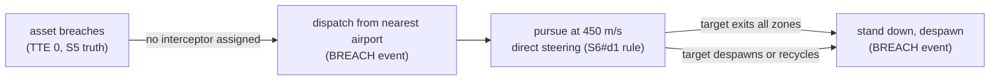

# S10 — Interceptor dispatch (FR-6, extra)

Issue: #13. Closes via the story PR. Depends on S5 (breach truth), S6 (pursuit
pattern), S3 (motion loop for glide).

## Purpose

Close the response loop: a breach dispatches an interceptor from the nearest
real airport, it flies its target with a live intercept estimate, and it
stands down when the breach resolves. FR-6 is the last unimplemented
requirement; this story completes functional coverage.

## Design

- `server/src/airports.ts`: a static dataset of six real airports inside the
  sector (CYOW Ottawa, CYUL Montreal, CYGK Kingston, CYND Gatineau, CYRP
  Carp, CYPQ Peterborough) with ICAO code, name, and position.
- `server/src/interceptor.ts`: `stepInterceptors(world, dt)`, ticked after
  derive so breach truth is current.
  - Dispatch: every breached asset (TTE 0) without an assigned interceptor
    gets one, spawned at the airport nearest to the breacher at dispatch
    time. Callsigns VIPER-01, VIPER-02, monotonic.
  - Pursuit: steer directly at the target's current position at 450 m/s
    (the S6#d1 honesty rule: pursuit, not lead-angle intercept).
  - Estimate: `interceptSeconds = distance to target / closing speed`, where
    closing speed is the component of relative velocity along the line of
    sight; null when not closing (opening geometry reads as no estimate,
    not a fake countdown).
  - Stand-down: the interceptor despawns when its target is no longer
    breached (exited all zones), despawned, or recycled. Dispatch and
    stand-down emit BREACH-kind events naming interceptor, airport, target.
- Wire: `Interceptor` joins the contract; tick and snapshot carry
  `interceptors: Interceptor[]`. Separate entity class from SEN-01 and from
  traffic (never in TRACKS, never threat-derived).
- Client:
  - `interceptorLayer`: ink chevron divIcon rotated to heading with a mono
    microlabel; a dim line to its target. Ink, not cyan or red: the
    interceptor is a friendly response asset, not the Sentinel and not a
    threat.
  - Motion: interceptors join the S3 loop as a third buffered group; the
    chevron glides like everything else.
  - Panel: clicking an interceptor opens the inspector shell with the
    interceptor's fields (callsign, origin airport, target identity and
    speed, live intercept estimate). Selection is per-client and mutually
    exclusive with asset selection.

## Interfaces

### Messages and Endpoints

| Name | Type | Action | Payload | Description |
|---|---|---|---|---|
| `tick` | WebSocket | push, server to client | adds `interceptors: Interceptor[]` | Full interceptor state per tick (D8 wholesale). |
| `snapshot` | WebSocket | push, server to client | world gains `interceptors` | Rehydration parity. |

### Flowchart - Interceptor Lifecycle

## Decisions

Story-local decisions are numbered for citation from code (S10#dN).
- d1: One interceptor per breacher, assigned at dispatch and never reassigned:
  reassignment mid-flight would need the hysteresis machinery of S6 for an
  entity whose whole life is seconds long.
- d2: Closing-speed estimate over distance-over-speed: a tail chase at nearly
  matched speeds honestly reports a long intercept, and an opening geometry
  reports none at all (null), not a fiction.
- d3: Interceptors are wire-separate from assets: TRACKS counts surveilled
  traffic, threat derivation applies to traffic, and mixing response assets
  into either would corrupt both displays.
- d4: Airport nearest to the breacher, not to the predicted intercept point:
  simpler, defensible (scramble the closest field), and the difference is
  cosmetic at sector scale.

## Acceptance

- FR-6 acceptance criteria: dataset, spawn at nearest airport on breach,
  detail panel with target identity and live intercept estimate, despawn when
  the target exits all zones.
- Interceptors never appear in TRACKS and never receive threat colors.
- Events narrate dispatch and stand-down.

## Review

### Gate Note

Self-served under the wrap-up ruling (see S5 doc); async PR comments still
override.

### Build Verification

38 tests green, six new for the interceptor lifecycle: nearest-airport
selection, single dispatch per breacher with the event text, closing
estimate decreasing tick over tick, null on opening geometry (S10#d2),
stand-down on target exit with the event, stand-down on target despawn.
Live: a zone across the YYZ-YUL trunk scrambled VIPER-01 through -04 from
CYRP (genuinely the nearest field), chevrons flew the intercept with dim
target lines under motion interpolation, the panel showed ORIGIN CYRP /
TARGET ROU-549 / TGT SPD / SPD 450 / INTERCEPT counting 52 to 49 s live,
and the ticker narrated dispatch and stand-down. TRACKS held at 120
throughout (S10#d3: interceptors never enter the traffic display).

### Codex Review (PR #29) - Disposition

Codex P2, confirmed real: the zone-mutation synthesized tick recomputed
breach truth but carried stale interceptor state, so a fresh zone could show
CRITICAL assets with no responder (and a deleted zone could show orphaned
interceptors) for up to a second. rederiveAndBroadcast now runs a zero-dt
interceptor step — dispatch and stand-down happen, nobody moves — before
broadcasting, keeping the synthesized tick internally consistent.
