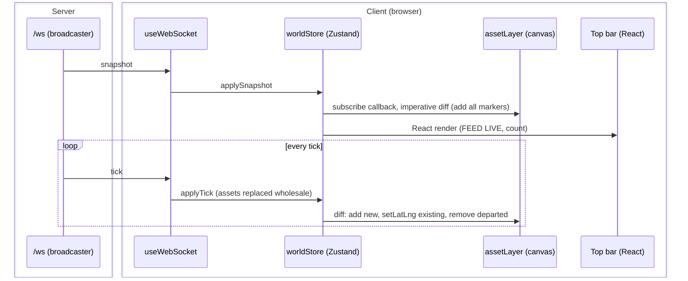

# S2 — Asset render (FR-1)

Issue: #5. Closes via the story PR. Depends on S1 (PR #15).

## Purpose

Put the world on the map: the client opens the WebSocket, holds the world in a
store, and renders every asset as a live canvas marker (i.e., the story where
FEED: BOOT becomes FEED: LIVE). Also closes S0's deferred acceptance item: the
client exercises the shared types import.

## Design

- `client/src/net/useWebSocket.ts`: opens `/ws` through the Vite proxy with the
  native browser WebSocket, parses the `WsMessage` union, and dispatches each
  message to the store. Basic reconnect on close (fixed 2 s retry); full backoff
  and the stale indicator are S8 scope.
- `client/src/state/worldStore.ts` (Zustand, D2): assets as a Map keyed by id,
  drone, zones, patrol, events, `lastTickMs`, and `connection`
  (`connecting | live | closed`). Actions: `applySnapshot`, `applyTick`,
  `applyZones`, `applyPatrol`, `applyEvent`, `setConnection`. Wire messages map
  one-to-one onto actions; no derived computation client-side (D3).
- `client/src/map/assetLayer.ts` (plain Leaflet, D6): one `L.circleMarker` per
  asset on the canvas renderer, keyed by id in a Map. Subscribes to the store
  outside React and diffs imperatively: add new ids, `setLatLng` existing,
  remove departed. React never re-renders per tick; it renders chrome only.
- Marker style from the token sheet: ink dots, radius 2.5, no stroke. Threat
  colors arrive in S9; positions snap at 1 Hz until S3 interpolates.
- Top bar reads from the store: FEED: LIVE with live track count, or
  CONNECTING / CLOSED.

## Interfaces

### Data Model

Client store state (no new wire types; the store mirrors the contract):

| Field | Type | Source |
|---|---|---|
| `assets` | `Map<string, Asset>` | snapshot, then replaced each tick |
| `drone` | `DroneState` | snapshot, tick |
| `zones` | `ZonePolygon[]` | snapshot, zones message |
| `patrol` | `PatrolPath \| null` | snapshot, patrol message |
| `events` | `EventEntry[]` | snapshot, event message (capped 50) |
| `lastTickMs` | `number` | tick |
| `connection` | `'connecting' \| 'live' \| 'closed'` | socket lifecycle |

### Sequence Diagram - Client Data Path

### Messages and Endpoints

S2 adds no messages or endpoints; it consumes the S1 contract.

| Name | Type | Action | Payload | Description |
|---|---|---|---|---|
| `snapshot` | WebSocket | consume | full world | Hydrates the store on connect and reconnect. |
| `tick` | WebSocket | consume | all asset states + drone | Replaces asset state each second. |

## Decisions

- The asset layer subscribes to the store imperatively, outside the React tree:
  per-tick marker updates bypass reconciliation entirely, and S3's
  requestAnimationFrame loop slots into the same layer module without moving a
  single component boundary.
- `L.circleMarker` over `divIcon`: canvas-batched dots scale to hundreds of
  markers; DOM icons do not. Symbology upgrades (S9) restyle the same markers.
- Assets replace wholesale each tick (matching D8's full-state wire) rather
  than patching: no diff bookkeeping, and the store can never drift from the
  server. Stated plainly: there is no age-out. An asset present on the client
  but absent from a subsequent tick is disposed of immediately, store and
  marker both. Flag for S7: a selected asset can be wiped from client state
  while its panel is open; the selection path must handle the missing record
  (the TRACK LOST behavior in FR-4) rather than assume its data source exists.

## Acceptance

- The map renders 100+ moving markers within ~2 s of load (1 Hz steps).
- The top bar shows FEED: LIVE and the live track count.
- Killing the server flips the bar off LIVE; restarting recovers via snapshot
  without a page refresh.
- The client imports and exercises `shared/types.ts` (closes the S0 deferred
  item).
- Strict typecheck clean; zero console errors.

## Review

### Round 1 - Design Gate, Operator Comments (Verbatim)

> - Flowchart I think would be more clear with a sequence diagram or at least borders to delineate the separation between
> - Titleize table headers for the endpoint tables
> - Infer plainly in decision 3 that there is no age-out and assets that are existing at the client and arent in a subsequent tick are disposed of. We will need to flag what to do about data being display for selected assets when they are wiped from the client state record.

### Disposition

Flowchart replaced with a sequence diagram (participants delineate the layers;
the tick loop and the diff behavior are now explicit in time). Table headers
titleized here and as standing convention. Decision 3 states the no-age-out
disposal semantics plainly and flags the selected-asset wipe for S7's TRACK
LOST path.

Gate stamp: pending round 2.
