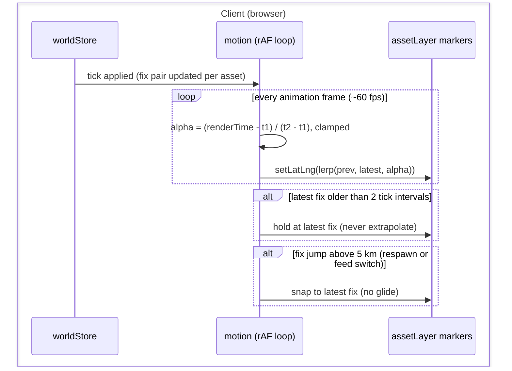

# S3 — Motion (D5)

Issue: #6. Closes via the story PR. Depends on S2.

## Purpose

Make the 1 Hz world glide: clients render one tick behind and interpolate
between known fixes at display rate, so 120 assets move continuously instead of
stepping (i.e., D5 made real).

## Design

- `client/src/map/motion.ts`: subscribes to the store; per asset keeps the two
  most recent fixes (previous, latest). A requestAnimationFrame loop computes
  render time as now minus one tick interval, derives alpha between the fix
  timestamps, linearly interpolates the position, and calls `setLatLng`
  directly on the marker (React untouched).
- The asset layer keeps ownership of marker add and remove; motion takes over
  position updates when active. Layer position-setting on tick becomes the
  fallback path when motion is disposed (the module is removable without
  trace, per the design ruling).
- Never extrapolate: if the latest fix is older than two tick intervals, hold
  position (S8's stale indicator covers the operator messaging).
- Teleport guard: a fix jump above 5 km snaps instead of gliding (respawn or
  feed-switch case).
- The drone marker joins the same loop in S6; heading interpolation takes the
  shortest arc.

## Interfaces

No wire or REST changes; no new store fields. Motion reads the store and
mutates Leaflet markers.

### Sequence Diagram - Render Path

The server does not appear: motion is a pure client concern consuming fixes the
store already holds. That absence is the design.

## Decisions

- Render one tick behind so interpolation always runs between two known fixes;
  extrapolation is banned because corrected predictions read as backward jumps.
- Linear interpolation only: at 1 s ticks and aircraft speeds, great-circle
  curvature between fixes is sub-pixel at every zoom this console uses.
- Position lerp happens in latitude and longitude directly (not projected
  space): error at this scale is negligible and the code stays obvious.

## Acceptance

- Assets glide smoothly at display rate; no 1 Hz stepping visible.
- No backward jumps under normal operation; missed ticks hold, then snap
  forward past the teleport threshold.
- React DevTools shows no per-frame renders (chrome renders at 1 Hz or less).
- Removing the module restores S2 behavior (1 Hz steps), nothing else breaks.

## Review

Pending design gate.
