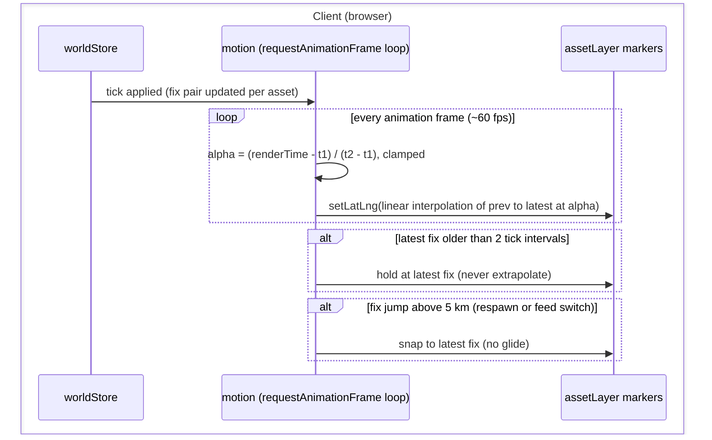

# S3 — Motion (D5)

Issue: #6. Closes via the story PR. Depends on S2.

## Purpose

Make the 1 Hz world glide: clients render one tick behind and interpolate
between known fixes at display rate, so 120 assets move continuously instead of
stepping (i.e., D5 made real).

## Design

- `client/src/map/motion.ts`: subscribes to the store; per asset keeps the two
  most recent fixes (previous, latest). A requestAnimationFrame loop (the
  browser API that invokes a callback once per display frame, about 60 times
  per second) computes render time as now minus one tick interval, derives
  alpha between the fix timestamps, linearly interpolates the position, and
  calls `setLatLng` directly on the marker (React untouched).
- Linear interpolation (lerp): given two known positions P1 at time t1 and P2
  at t2, the rendered position at time t between them is
  P1 + (P2 - P1) x alpha, where alpha = (t - t1) / (t2 - t1) runs 0 to 1. In
  plain terms: slide in a straight line from the previous fix to the latest
  fix, arriving exactly when the next fix is due.
- The asset layer keeps ownership of marker add and remove; motion takes over
  position updates when active. Layer position-setting on tick becomes the
  fallback path when motion is disposed (the module is removable without
  trace, per the design ruling).
- Never extrapolate: if the latest fix is older than two tick intervals, hold
  position (S8's stale indicator covers the operator messaging).
- Teleport guard: a fix jump above 5 km snaps instead of gliding (respawn or
  feed-switch case).
- The drone marker joins the same loop in S6; heading interpolation takes the
  shortest arc.

## Interfaces

No wire or REST changes; no new store fields. Motion reads the store and
mutates Leaflet markers.

### Sequence Diagram - Render Path

The server does not appear: motion is a pure client concern consuming fixes the
store already holds. That absence is the design.

## Decisions

Story-local decisions are numbered for citation from code (S3#dN).
- d1: Render one tick behind so interpolation always runs between two known fixes;
  extrapolation is banned because corrected predictions read as backward jumps.
- d2: Linear interpolation only: at 1 s ticks and aircraft speeds, great-circle
  curvature between fixes is sub-pixel at every zoom this console uses.
- d3: Position lerp happens in latitude and longitude directly (not projected
  space): error at this scale is negligible and the code stays obvious.
- d4 (v2): explicit clock model — a per-entity ring of server-stamped fixes
  plus an exponentially smoothed offset between server time and
  performance.now. Attempt 1 derived its clock from fix-pair arrival timing,
  which is exactly what tick jitter breaks: segments starved (freeze) and
  rebased late (snap). Clamping at the newest fix makes the failure a brief
  hold; the next segment departs from the clamped position, so a snap is
  geometrically impossible.

## Acceptance

- Assets glide smoothly at display rate; no 1 Hz stepping visible.
- No backward jumps under normal operation; missed ticks hold, then snap
  forward past the teleport threshold.
- React DevTools shows no per-frame renders (chrome renders at 1 Hz or less).
- Removing the module restores S2 behavior (1 Hz steps), nothing else breaks.

## Review

### Round 1 - Design Gate, Operator Comments (Verbatim)

> - Elaborate on "lerp" terminology
> - Same as above with "rAF"

### Disposition

Both terms spelled out and defined at first use: requestAnimationFrame
described as the per-display-frame callback API, and linear interpolation
given its formula plus a plain-terms reading. Diagram labels updated to the
full terms.

### Round 2 - Design Gate Stamp (Verbatim)

> Approved, proceed with S3

### Round 3 - Functional Feedback (Verbatim)

> Still appears quite jumpy in the current preview

### Disposition (Round 3)

Diagnosis: interpolation measured flawless when the tab is fronted (45 samples
at 33 ms, zero spikes, velocity matching the asset envelope); the jumpiness is
browser suspension of requestAnimationFrame for occluded and backgrounded tabs
(side-pane viewing, and the second tab of the sync demo). Hardening applied:
a coarse 250 ms interval fallback keeps positions advancing under occlusion
(deep background throttles it to ~1 Hz, gracefully matching the tick rate);
a visibilitychange handler holds at the latest fix on return instead of
rubber-banding; and pair rotation now anchors at the marker's actual rendered
position, making arrival jitter mathematically unable to cause snaps.

### Round 4 - Deferral Ruling (Verbatim)

> Its not the pane, its likely the leaflet page render animation. Instead of chasing this., lets strip out the smoothing and defer to a future story following the asset coordination one

### Disposition (Round 4)

Story deferred, rescheduled after S12 (traffic structure). Prime suspect
recorded for the resumption: Leaflet's canvas renderer batches repaints
through its own requestAnimationFrame, so model-position updates from the
interval fallback do not repaint under rAF suspension — positions glide,
pixels freeze, then snap on the next painted frame. The resumption path is
forcing synchronous canvas redraws in the fallback, or driving the renderer
directly. The 1 Hz stepping of S2 is acceptable operator-console behavior in
the interim. Branch and PR preserved unmerged as the resumption point.

### Round 5 - Return (Build Note, v2)

S12 merged; D12's condition is met and motion returns. Two facts changed the
diagnosis since the deferral. First, the S9 pulse ring animates smoothly at
display rate through the same canvas renderer, which exonerates the "Leaflet
page render animation" suspect: the canvas repaints per-frame mutations
fine. Second, attempt 1 derived its render clock from fix arrival pairs, so
tick jitter starved segments (hold) and late rebases jumped them (snap) —
the freeze-and-snap signature the operator saw.

The v2 design replaces pair rotation with an explicit clock model (S3#d4):
a per-asset ring of recent fixes carrying server timestamps, an
exponentially smoothed offset between server time and performance.now, and
a render clock at estimated server-now minus one tick minus a safety margin.
Each frame finds the straddling fix pair and interpolates; a render time
past the newest fix clamps there (never extrapolates, d1), and the next
tick's segment departs from exactly the clamped position, so late ticks
cost only a brief hold — a snap is geometrically impossible. Attempt 1's
occlusion hardening (250 ms interval fallback, visibility rebase) carries
forward. The loop is the one rAF the S3 contract promises: the S9 pulse
(S9#d3) and the selection ring follower register as frame callbacks, and
the drone glides with shortest-arc heading rotation applied to the icon
element directly (no per-frame setIcon churn).

### Round 6 - Build Verification (v2)

Model motion: a corridor asset sampled every 100 ms over 5 s advanced a
steady 21 to 24 m per sample (about 220 m/s, matching its envelope), zero
stalls, no backward motion; the only irregularity is a sub-second settle at
page load while the offset estimate warms. Paint motion — the measurement
attempt 1 never made: the canvas renderer's redraw counter ran at 74.6
redraws per second over 3 s, full display rate, which closes D12's "canvas
repaints ride the renderer's own rAF" suspicion (the pulse ring's smooth S9
animation had already implicated timing, not painting). One rAF owns all
motion per the contract: the S9 pulse and the selection-ring follower run as
registered frame callbacks (S9#d3 fulfilled), and the drone glides with
shortest-arc heading applied to the icon element without setIcon churn.
Occlusion hardening carried from attempt 1 (250 ms fallback under
document.hidden). React untouched per frame. Final visual sign-off remains
the operator's: attempt 1's instruments also read clean while the operator
saw jumpiness, so the eyeball test is explicitly still open.
