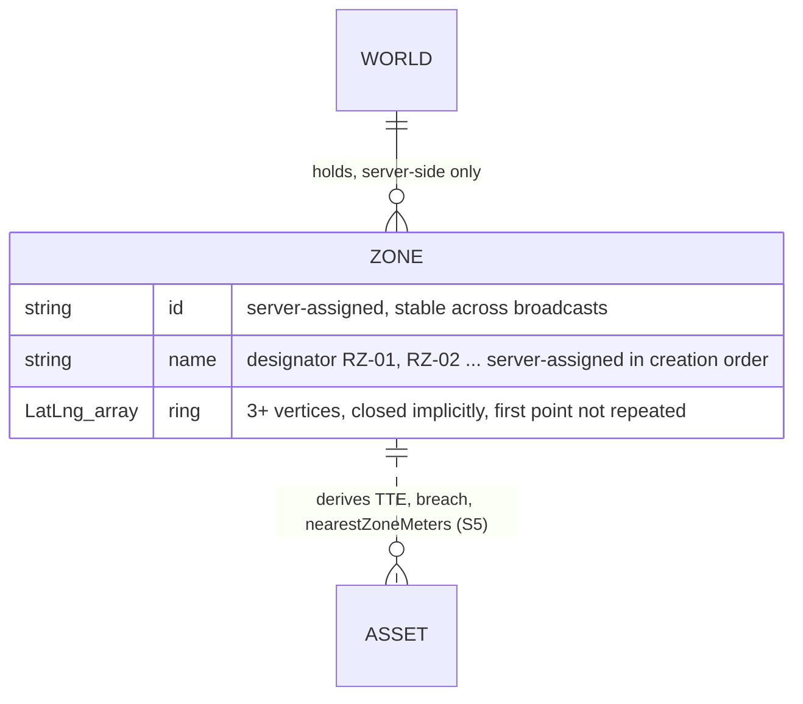
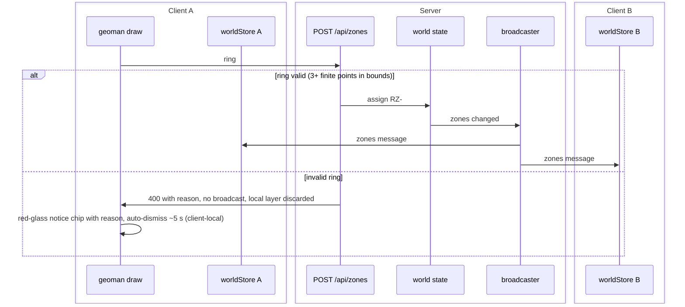

# S4 — Zones (FR-2, first half)

Issue: #7. Closes via the story PR. Depends on S2.

## Purpose

Give operators restricted zones: polygon draw and delete on the map, persisted
server-side, visible in every client within a second. TTE and threat remain
placeholders until S5 computes them.

## Design

- Drawing: leaflet-geoman, polygon tool plus removal mode only (no vertex
  editing, per the FR-2 ruling). Draw toolbar styled to the token sheet.
- On draw complete the client POSTs the ring; the server assigns the id and the
  next designator (RZ-01, RZ-02, ...), stores the zone, emits a `zones`
  broadcast and a `ZONE` event. The local geoman layer is removed immediately;
  the rendered zone always comes back from the store (single source of truth,
  D3 applied to geometry).
- `client/src/map/zoneLayer.ts`: imperative like the asset layer; renders each
  zone as a red dashed polygon (token: --red at 12 percent fill) with a
  designator label at the centroid.
- Validation, server-authoritative (client-side geoman also prevents
  self-intersection at draw time via allowSelfIntersection false). A ring is
  valid iff all of the following hold; anything else is a 400 with a reason
  and no broadcast:
  1. 3+ vertices after normalizing away a duplicated closing point (first ==
     last is tolerated and stripped).
  2. Every coordinate finite and within the WGS84 coordinate domain: lat in
     [-90, 90], lng in [-180, 180], no NaN or Infinity. Deliberately NOT
     restricted to the sector box: the sector is a view and spawn convention
     invisible to the operator, and rejecting a harmless ring against an
     unmarked boundary would be a confusing 400. The viewport naturally
     scopes where zones get drawn. Exclusion, recorded: rings crossing the
     antimeridian are out of scope (containment would need longitude
     unwrapping; the sector sits at -78 to -73).
  3. No zero-length edges (consecutive duplicate vertices).
  4. Non-degenerate: nonzero area (an all-collinear ring has no interior, so
     breach against it is meaningless).
  5. Simple: no self-intersecting edges (a figure-eight makes "inside"
     ambiguous, so TTE and breach semantics would depend on fill rule; the
     O(n squared) segment-intersection check is trivial at zone scale).
  6. At most 100 vertices (payload sanity).
- Rejection feedback is client-local and transient: a red-glass notice chip
  (threat-chip tokens) below the status bar shows the reason from the 400
  body and auto-dismisses after about 5 seconds. Rejections are private to
  the submitting tab: they never enter the event stream, which broadcasts to
  every operator. Primary UX is prevention (geoman blocks self-intersection
  and short rings at draw time); the notice is the safety net for the
  server-authoritative path.

## Interfaces

### Data Model

ZONE is the `ZonePolygon` wire type from the S1 contract, populated for the
first time here; no wire change. The ring is stored exactly as drawn (no
simplification, no vertex editing per the FR-2 ruling), and the dotted
relationship is computed by S5, not stored: zones hold no references to
assets.

Terminology (GIS-standard nesting, GeoJSON RFC 7946): the polygon is the areal
feature — the zone, the thing with an inside — and the ring is the closed
vertex loop bounding it. A polygon is defined by rings: one exterior ring plus
optional interior rings for holes. ZonePolygon is the restricted case: exactly
one exterior ring, no holes (a donut zone is out of scope; nothing in FR-2
wants one). Deviation from GeoJSON, by design: a true linear ring closes
explicitly (first point repeated as last); ours closes implicitly — 3+
distinct vertices, edges being consecutive pairs plus last-to-first.
Validation clause 1 bridges the conventions: explicit closure from a client is
tolerated and stripped, implicit closure is stored.

### Messages and Endpoints

| Name | Type | Action | Payload | Description |
|---|---|---|---|---|
| `/api/zones` | REST | POST | `{ ring: LatLng[] }` | Creates a zone; server assigns id and designator. Returns the zone. |
| `/api/zones/:id` | REST | DELETE | — | Removes the zone; recomputation and drone disengage follow on the next tick. |
| `zones` | WebSocket | push, server to client | `ZonePolygon[]` | Full zone list on any change. |

### Sequence Diagram - Zone Creation

## Decisions

Story-local decisions are numbered for citation from code (S4#dN).
- d1: The drawn geoman layer is discarded and re-rendered from the broadcast: both
  tabs render zones from identical state, and the drawing tab cannot drift
  from the server.
- d2: Full zone list per broadcast (not deltas), matching the D8 wholesale
  philosophy at zone scale (a handful of polygons).
- d3: Designators are server-assigned so two tabs drawing concurrently cannot
  mint RZ-01 twice.
- d4: Rejection feedback is client-local, never an event: the event stream is
  shared operational context for all operators, and a single tab's invalid
  submission is not. The 400 response body is already private to the
  submitter; the notice chip surfaces it.
- d5 (build): validation clause 5 (simplicity) is evaluated before clause 4
  (non-degenerate area). A symmetric figure-eight has zero signed area (its
  lobes cancel in the shoelace sum), so testing degeneracy first misreports
  self-intersection as collinearity. Caught during build verification; the
  clause list itself is unchanged, only evaluation order.

## Acceptance

- Draw a polygon: it appears with a designator in both tabs within 1 s.
- Delete a zone: gone from both tabs within 1 s.
- Zones survive client refresh (server-persisted, rehydrated via snapshot).
- Invalid rings are rejected with a 400 and no broadcast.

## Review

### Round 1 - Design Gate, Operator Comments (Verbatim)

> Do we have a model of zone for the s4 design doc? like ERD?

### Disposition

It was missing. Data Model section added: the ZONE entity with field
annotations (server-assigned id and designator, ring storage rule), its
containment in WORLD, and the dotted computed-not-stored relationship to
assets via S5. Noted as the S1 contract type populated here, no wire change.

### Round 2 - Design Gate, Operator Comments (Verbatim)

> What defines an invalid ring?

### Disposition (Round 2)

The doc under-specified it (arity, finiteness, bounds only). Validation
expanded to the full six-clause definition: arity after closing-point
normalization, finite coordinates in range, no zero-length edges,
non-degenerate area, simplicity (no self-intersection, with the fill-rule
ambiguity rationale), and a vertex cap. Client-side geoman prevents
self-intersection at draw time; the server verifies regardless.

### Round 3 - Design Gate, Operator Comments (Verbatim)

> How do we inform the user that they submitted an invalid polygon?

### Disposition (Round 3)

The doc had silent discard. Added: client-local transient rejection notice
(red-glass chip below the status bar, reason from the 400 body, auto-dismiss
about 5 s), recorded as S4#d4 with the privacy rationale (rejections never
enter the shared event stream). Sequence diagram carries the notice in the
invalid branch. Prevention remains the primary UX; the notice is the
server-authoritative safety net.

### Round 4 - Design Gate, Operator Comments (Verbatim)

> What defines valid bounds for the ring?

### Disposition (Round 4)

Clause 2 clarified: bounds are the WGS84 coordinate domain, deliberately not
the sector box (invisible boundary, harmless violation, confusing rejection);
antimeridian-crossing rings recorded as out of scope with the reason.

### Round 5 - Design Gate, Operator Comments (Verbatim)

> Is it a true ring or a polygon as the name suggests? The naming implies both. If it missed the description please specify where this is detailed

### Disposition (Round 5)

Both, in the standard GIS nesting, and the doc had not explained it: a
terminology paragraph now defines polygon (the areal feature) vs ring (its
bounding vertex loop), states the one-exterior-ring-no-holes restriction, and
records the deliberate deviation from GeoJSON explicit closure with the
clause-1 bridge. Previously detailed only as a types.ts comment and the ERD
field annotation.

### Round 6 - Design Gate, Operator Comments (Verbatim)

> Approved, proceed with S4

### Disposition (Round 6)

Gate closed. Build verification: all six clauses exercised via curl (arity,
WGS84 domain, duplicate vertices, collinearity, figure-eight, vertex cap);
explicit closure stripped and normalized; designators stayed monotonic across
a delete (RZ-02 deleted, next zone minted RZ-04, no reuse); ZONE events in
the snapshot ledger; zones render in the client from broadcast state with
centroid designator labels, and a hand-drawn geoman polygon round-tripped
through POST, broadcast, and re-render. One build finding recorded as S4#d5
(clause evaluation order). Component diagram re-verified: README already
lists the zone layer and /api/zones; no delta.

### Build Feedback - Operator Comments (Verbatim)

> Lets enlarge the buttons and place them in the upper-right hand corner of the page. They should at least double in padding

### Disposition (Build Feedback)

Geoman toolbar moved from bottom right to top right (offset below the status
bar) and buttons enlarged to 44 px with 12 px padding, icons scaled to fit.
Verified in the live preview alongside a rendered zone.
