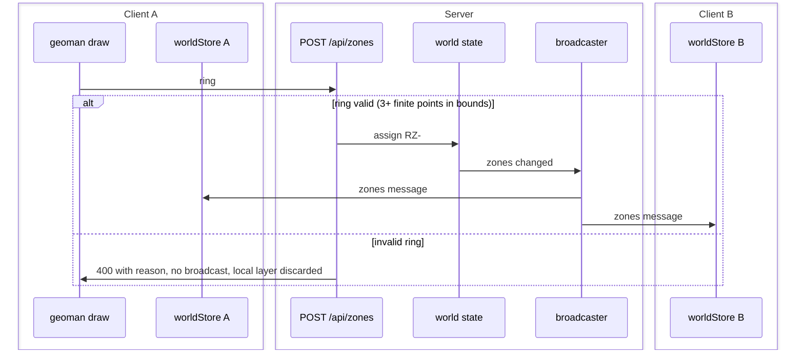

# S4 — Zones (FR-2, first half)

Issue: #7. Closes via the story PR. Depends on S2.

## Purpose

Give operators restricted zones: polygon draw and delete on the map, persisted
server-side, visible in every client within a second. TTE and threat remain
placeholders until S5 computes them.

## Design

- Drawing: leaflet-geoman, polygon tool plus removal mode only (no vertex
  editing, per the FR-2 ruling). Draw toolbar styled to the token sheet.
- On draw complete the client POSTs the ring; the server assigns the id and the
  next designator (RZ-01, RZ-02, ...), stores the zone, emits a `zones`
  broadcast and a `ZONE` event. The local geoman layer is removed immediately;
  the rendered zone always comes back from the store (single source of truth,
  D3 applied to geometry).
- `client/src/map/zoneLayer.ts`: imperative like the asset layer; renders each
  zone as a red dashed polygon (token: --red at 12 percent fill) with a
  designator label at the centroid.
- Validation server-side: ring is 3 or more points, all finite lat and lng
  within world bounds; invalid input is a 400 with a reason.

## Interfaces

### Messages and Endpoints

| Name | Type | Action | Payload | Description |
|---|---|---|---|---|
| `/api/zones` | REST | POST | `{ ring: LatLng[] }` | Creates a zone; server assigns id and designator. Returns the zone. |
| `/api/zones/:id` | REST | DELETE | — | Removes the zone; recomputation and drone disengage follow on the next tick. |
| `zones` | WebSocket | push, server to client | `ZonePolygon[]` | Full zone list on any change. |

### Sequence Diagram - Zone Creation

## Decisions

- The drawn geoman layer is discarded and re-rendered from the broadcast: both
  tabs render zones from identical state, and the drawing tab cannot drift
  from the server.
- Full zone list per broadcast (not deltas), matching the D8 wholesale
  philosophy at zone scale (a handful of polygons).
- Designators are server-assigned so two tabs drawing concurrently cannot
  mint RZ-01 twice.

## Acceptance

- Draw a polygon: it appears with a designator in both tabs within 1 s.
- Delete a zone: gone from both tabs within 1 s.
- Zones survive client refresh (server-persisted, rehydrated via snapshot).
- Invalid rings are rejected with a 400 and no broadcast.

## Review

Pending design gate.
