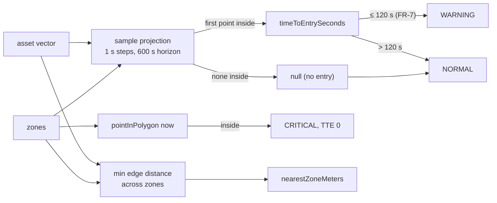

# S5 — Derived truth (FR-2 second half, FR-7 source)

Issue: #8. Closes via the story PR. Depends on S4.

## Purpose

Replace the wire placeholders with computed truth: per-asset time to entry,
breach state, nearest-zone distance, and threat tier, computed server-side only
(D3), as pure unit-tested functions. Vitest lands here.

## Design

- `shared/geo.ts` gains two pure primitives: `pointInPolygon` (ray cast) and
  `distanceToSegmentMeters` (planar approximation, adequate at sector scale).
- `server/src/derive.ts`, pure functions with no world access:
  - `computeTimeToEntry(asset, zones)`: samples the asset's straight-line
    projection at 1 s steps out to a 600 s horizon; the first sampled point
    inside any zone gives TTE in seconds. No crossing within the horizon
    returns null (renders as no-entry).
  - Inside any zone now: TTE 0, breached.
  - `computeNearestZoneMeters(asset, zones)`: minimum edge distance across all
    zones.
  - `computeThreat(tte, breached)`: CRITICAL if breached, WARNING if TTE is at
    or under 120 s (FR-7 ruling), else NORMAL.
- The tick loop calls derive for every asset after movement, before broadcast.
  The wire shape is unchanged; nulls simply become numbers.
- Tests: vitest in the server workspace. Hand-computed cases: head-on course
  at known speed and distance (exact expected TTE), parallel course (null),
  asset inside (0, CRITICAL), threshold boundary (120 s is WARNING, 121 s is
  NORMAL), square zone edge distances, polygon edge cases (point on vertex).

## Interfaces

No wire or REST changes: S5 fills fields that have existed since S1.

### Flowchart - Threat Derivation

## Decisions

Story-local decisions are numbered for citation from code (S5#dN).
- d1: Sampled projection over analytic great-circle-vs-polygon intersection: the
  bound is explicit (1 s resolution, 600 s horizon), the code is readable, and
  the cost is trivial at this scale (about 72k point tests per tick worst
  case). The analytic version is the optimization nobody asked for.
- d2: 600 s horizon: beyond ten minutes a straight-line prediction is fiction;
  null is more honest than a large number.
- d3: Derivation stays out of the world module: pure inputs to pure outputs, which
  is what makes the tests hand-checkable.
- d4 (build): pointInPolygon is boundary-inclusive — a point on a zone edge or
  vertex counts as inside. Conservative is correct for restricted zones.
- d5 (build): nearestZoneMeters is null when no zones exist; a number would
  imply a measurement that has no referent.

## Acceptance

- All FR-2 TTE behavior real on the wire; panel placeholders now show values.
- Unit tests green, including the hand-computed head-on case and the 120 s
  threshold boundary.
- `npm test` works from the root (the S0 Codex finding closes for good).
- Tick duration stays well under the interval at 120 assets with zones present.

## Review

### Gate Note

The live design gate is self-served from here: the operator signed elsewhere
on Jul 22 and directed the project to wrap for completeness ("im going to
have this project wrap up for completeness sake"). Async PR comments still
override.

### Build Verification

14 unit tests green (head-on hand-computed TTE, parallel null, inside 0,
600 s horizon null, FR-7 boundary 120/121, breach CRITICAL, null NORMAL,
square edge distances, endpoint clamp, boundary-inclusive vertex and edge).
Root npm test wired through the server workspace (S0 Codex finding closed).
Live: sector-wide zone produced 14 CRITICAL / 3 WARNING / 103 NORMAL over
120 assets, TTE on 28, nearest-zone on all; sample WARNING asset cross-checked
(69 s at ~215 m/s vs 14.9 km reported); tick gap 1002 ms.
