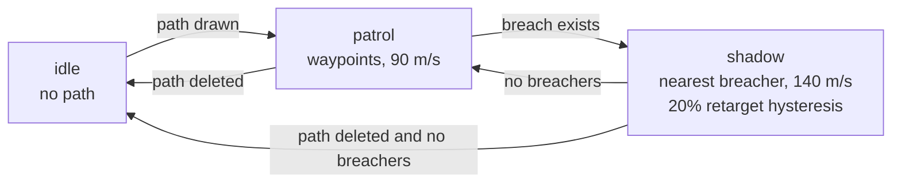

# S6 — Drone (FR-3)

Issue: #9. Closes via the story PR. Depends on S5 (breach state drives shadow).

## Purpose

SEN-01 earns its name: a user-drawn patrol path, waypoint flight, and shadow
pursuit of the nearest breacher, with the mode machine and events visible to
every client.

## Design

- Patrol drawing: geoman polyline tool; PUT replaces the path, DELETE clears
  it. Rendered as a dashed cyan polyline from the broadcast (same
  render-from-store rule as zones).
- `server/src/drone.ts`: the FSM, ticked from the tick loop.
  - `idle`: no patrol path. Drone holds position, speed 0.
  - `patrol`: fly waypoints in order at 90 m/s, looping; waypoint reached at
    under 500 m switches target to the next.
  - `shadow`: any breached asset exists. Target the breacher nearest to the
    drone; steer directly toward its current position each tick at 140 m/s.
    Retarget only when another breacher is more than 20 percent nearer
    (hysteresis, FR-3 ruling). All targets clear: return to `patrol`, resuming
    at the nearest waypoint (or `idle` if no path).
  - Transitions emit `SENTINEL` events (patrol to shadow names the target).
- Client: drone rendered as the cyan hollow hexagon with center dot (divIcon,
  SVG, rotated to heading); mode label under it. Shadow tether: a solid cyan
  line drone-to-target (licensed glow exception T1; red stays threat-only per
  T2). Motion loop (S3) interpolates the drone like any asset.

## Interfaces

### Messages and Endpoints

| Name | Type | Action | Payload | Description |
|---|---|---|---|---|
| `/api/patrol` | REST | PUT | `{ points: LatLng[] }` | Replaces the patrol path (2 or more points). |
| `/api/patrol` | REST | DELETE | — | Clears the path; drone goes idle after any shadow resolves. |
| `patrol` | WebSocket | push, server to client | `PatrolPath \| null` | On change. |

Drone state already travels in every tick message (S1 contract).

### Flowchart - Drone FSM

## Decisions

- Pursuit steers at the target's current position (no lead-angle intercept):
  FR-3 says shadow, not intercept; the simpler control is also the honest one.
- Speed caps (90 patrol, 140 shadow) keep the drone slower than most traffic:
  shadowing reads as following, and pursuit geometry stays visible on screen.
- The FSM is a pure function of (drone, patrol, assets, dt) returning the next
  drone state plus events: unit-testable beside S5's functions.

## Acceptance

- All FR-3 acceptance criteria (draw, loop, shadow nearest, hysteresis,
  revert, idle states).
- FSM transitions appear in the event stream in both tabs.
- The hexagon rotates with heading; the tether renders only in shadow mode.

## Review

Pending design gate.
