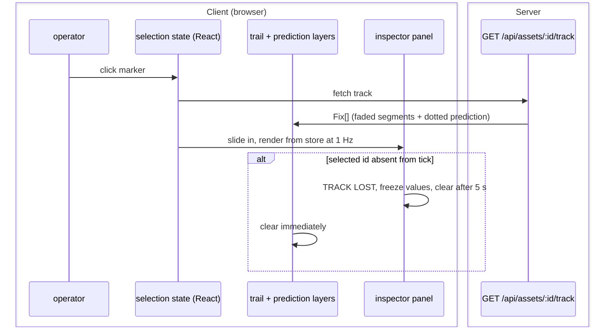

# S7 — Intel (FR-4)

Issue: #10. Closes via the story PR. Depends on S5 (real TTE and threat in the
panel) and S3 (selection over interpolated markers).

## Purpose

Click an asset and know it: faded history trail, dotted predicted path, and a
slide-out inspector carrying the derived truth. Selection is per-client (FR-5
ruling) and survives despawn honestly (TRACK LOST).

## Design

- Selection: circleMarker click sets `selectedAssetId` in local React state
  (not the world store, not synced). Clicking empty map or the panel close
  clears it.
- Hover affordance (operator addition, batch gate; mechanism revised after
  operator functional testing on S2): the canvas renderer's built-in
  `tolerance` option (8 px) adds click-slop to every interactive layer — one
  option instead of invisible hit geometry, and it directly addresses the
  observed pan-vs-click conflict (micro-drags on tiny targets read as pans;
  a larger effective target absorbs them). On hover an ink ring appears
  around the marker (marker radius +4, ink at 40 percent) with a pointer
  cursor; on selection the ring persists solid until deselect. Ink, not cyan
  or red: hover is affordance, not state, and the color budget stays
  intact.
- History: on select the client GETs the asset's track and renders it as a
  polyline in about 10 opacity-bucketed segments, oldest faintest. History is
  fetched over REST, not the wire: tick payloads stay slim and history is only
  needed on demand.
- Prediction: average heading and speed over the fetched fixes (up to 5 min),
  dead-reckoned 5 min forward, drawn dotted per the design system.
- Inspector: right slide-out glass panel (the ruled layout's first panel):
  callsign, altitude, speed, heading, TTE, distance to nearest zone, threat.
  Values re-render at 1 Hz from the store; threat text color matches map
  symbology source (single computed source, D3).
- TRACK LOST: the S2 disposal flag lands here. If the selected id vanishes
  from a tick, the panel freezes its last values under a TRACK LOST banner and
  auto-clears after 5 s; trail and prediction clear immediately.

## Interfaces

### Messages and Endpoints

| Name | Type | Action | Payload | Description |
|---|---|---|---|---|
| `/api/assets/:id/track` | REST | GET | — | Returns `Fix[]` from the server ring buffer; 404 if unknown. |

### Sequence Diagram - Selection

## Decisions

Story-local decisions are numbered for citation from code (S7#dN).
- d1: History over REST instead of the wire: on-demand data for one asset does not
  belong in a broadcast every client pays for each second.
- d2: Trail fade via bucketed segments (about 10) instead of per-point opacity:
  visually identical, an order of magnitude fewer layers.
- d3: The prediction uses the same averaging window the buffer holds; less than 5
  minutes of life means averaging what exists (matches FR-4 ruling).
- d5 (build): the asset layer is a FeatureGroup, not a LayerGroup — only
  FeatureGroup re-emits child marker events, which is what the interaction
  module subscribes to. Found when clicks fired on markers but never reached
  the group handler.
- d6 (build): suppressing the map's clear-selection click requires
  L.DomEvent.stopPropagation(leafletEvent), not stop(originalEvent): Leaflet's
  Map._fireDOMEvent checks an internal _stopped flag that only the
  Leaflet-event path sets. Found when selection was set and cleared in the
  same click.
- d4: Map panning keeps the drag-to-pan convention (operator ruling). A
  spacebar-modified pan was considered to eliminate the pan-vs-click conflict
  outright, but drag-to-pan is the universal convention of map interfaces and
  a reviewer's first touch must not read as broken; the renderer tolerance
  (8 px) is expected to absorb the misfires. If functional testing with
  tolerance still fights, spacebar pan with a persistent on-screen hint is
  the approved fast-follow inside this story.

## Acceptance

- All FR-4 acceptance criteria (trail, prediction, panel fields, deselect,
  TRACK LOST on despawn).
- Panel values always equal map symbology state for the same asset.
- Selection in one tab does not affect the other (FR-5 ruling).

## Review

### Batch Gate - Operator Comments (Verbatim)

> Lets add a ring that appears around an asset when it hovered to make it easier to select as well.

> Noticed during functional testing that the pan controls for the map are always available, making it even harder to select (or click on) assets. Also, I am not seeing any hover effects to increase the selectable area for these assets.

(Second comment arrived on the S2 PR during functional testing; interaction is
S7 scope, so it lands here.)

> Can we add pan controls to the map instead of keeping it always on? Open to the space-bar modified for pan as is common applications if that happens to be out of the box.

> Lets go with B. Can record in the relevant design that there was a decision here

(Options presented: A spacebar pan with hint; B convention plus tolerance,
spacebar as evidence-gated fast-follow. Operator ruled B; recorded as S7#d4.)

Disposition: hover ring in Design; selected state persists the ring solid;
ink at 40 percent per the color budget. Hit-slop mechanism revised per the
functional-testing comment: canvas renderer `tolerance` (8 px) replaces
invisible hit circles — less geometry, and it absorbs the micro-drag pans
observed on tiny targets. S2 itself ships no interaction by design.

Pending batch design gate.

### Gate Note

Self-served under the wrap-up ruling (see S5 doc); async PR comments still
override.

### Build Verification

Track endpoint returns chronological fixes (61 after a minute of life) and
404 on unknown ids. Selection verified through the real canvas hit-test path
(synthesized DOM click on the renderer canvas): select, panel slide-in with
live 1 Hz values, empty-map click deselects. Renderer tolerance 8 px active
(hit region radius + tolerance). Trail renders bucketed fade plus dotted
5 min prediction; a zone across the sector filled TTE/ZONE/THREAT in the
panel with colors matching map symbology source. Two real defects found and
fixed during verification, recorded as S7#d5 and S7#d6. TRACK LOST could not
be exercised live: the generator never despawns assets, so no natural
trigger exists; the freeze-banner-clear logic ships with the panel and its
trigger arrives with any future despawn source. Automation note: the browser
tool's physical clicks carry a micro-drag Leaflet suppresses as a pan, which
is the same conflict the operator observed in S2 functional testing —
tolerance absorbs near-misses but cannot absorb drags; S7#d4's
spacebar-pan fast-follow stays evidence-gated on human testing.

### Codex Review (PR #23) - Disposition

Two P2s, both confirmed real. First: the prediction bearing used net
first-to-last displacement, which is not the average heading on a curved
track; replaced with the circular mean of per-segment bearings weighted by
segment length. Second: a stale failed track request cleared the current
selection's trail; the failure path now carries the same selected-id guard
as the success path.
