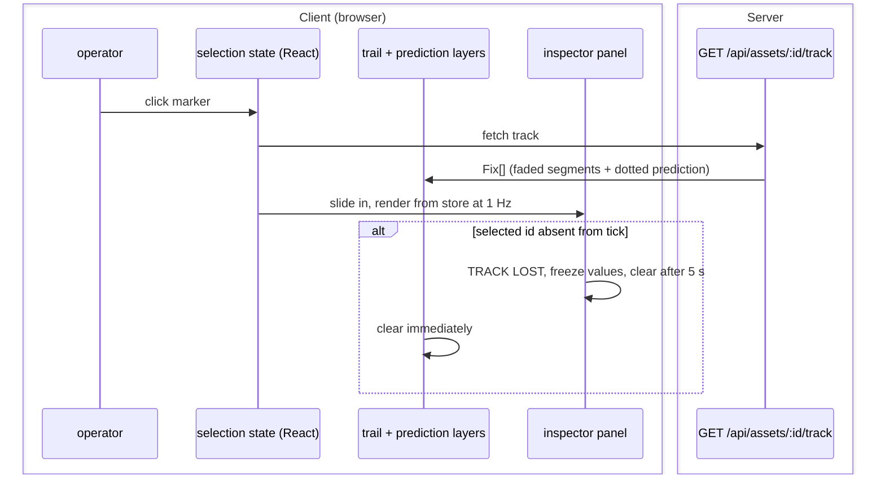

# S7 — Intel (FR-4)

Issue: #10. Closes via the story PR. Depends on S5 (real TTE and threat in the
panel) and S3 (selection over interpolated markers).

## Purpose

Click an asset and know it: faded history trail, dotted predicted path, and a
slide-out inspector carrying the derived truth. Selection is per-client (FR-5
ruling) and survives despawn honestly (TRACK LOST).

## Design

- Selection: circleMarker click sets `selectedAssetId` in local React state
  (not the world store, not synced). Clicking empty map or the panel close
  clears it.
- Hover affordance (operator addition, batch gate): each asset carries an
  invisible hit-target circle (radius 8) widening the effective click area; on
  hover an ink ring appears around the marker (marker radius +4, ink at 40
  percent) with a pointer cursor. On selection the ring persists solid until
  deselect. Ink, not cyan or red: hover is affordance, not state, and the
  color budget stays intact.
- History: on select the client GETs the asset's track and renders it as a
  polyline in about 10 opacity-bucketed segments, oldest faintest. History is
  fetched over REST, not the wire: tick payloads stay slim and history is only
  needed on demand.
- Prediction: average heading and speed over the fetched fixes (up to 5 min),
  dead-reckoned 5 min forward, drawn dotted per the design system.
- Inspector: right slide-out glass panel (the ruled layout's first panel):
  callsign, altitude, speed, heading, TTE, distance to nearest zone, threat.
  Values re-render at 1 Hz from the store; threat text color matches map
  symbology source (single computed source, D3).
- TRACK LOST: the S2 disposal flag lands here. If the selected id vanishes
  from a tick, the panel freezes its last values under a TRACK LOST banner and
  auto-clears after 5 s; trail and prediction clear immediately.

## Interfaces

### Messages and Endpoints

| Name | Type | Action | Payload | Description |
|---|---|---|---|---|
| `/api/assets/:id/track` | REST | GET | — | Returns `Fix[]` from the server ring buffer; 404 if unknown. |

### Sequence Diagram - Selection

## Decisions

- History over REST instead of the wire: on-demand data for one asset does not
  belong in a broadcast every client pays for each second.
- Trail fade via bucketed segments (about 10) instead of per-point opacity:
  visually identical, an order of magnitude fewer layers.
- The prediction uses the same averaging window the buffer holds; less than 5
  minutes of life means averaging what exists (matches FR-4 ruling).

## Acceptance

- All FR-4 acceptance criteria (trail, prediction, panel fields, deselect,
  TRACK LOST on despawn).
- Panel values always equal map symbology state for the same asset.
- Selection in one tab does not affect the other (FR-5 ruling).

## Review

### Batch Gate - Operator Comments (Verbatim)

> Lets add a ring that appears around an asset when it hovered to make it easier to select as well.

Disposition: hover ring plus widened invisible hit target added to Design;
selected state persists the ring solid; ink at 40 percent per the color
budget.

Pending batch design gate.
