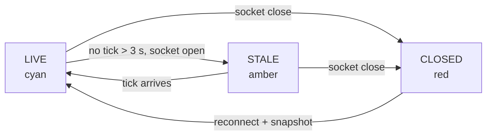

# S8 — Sync hardening (FR-5)

Issue: #11. Closes via the story PR. Depends on S2 (upgrades its fixed retry).

## Purpose

Make the sync layer honest under failure: exponential backoff, a stale-feed
indicator driven by tick age, and the event log with its slide-up drawer, so
the two-tab demo is clean and degradation is visible instead of silent.

## Design

- Reconnect: replace the fixed 2 s retry with exponential backoff (1, 2, 4, 8,
  capped 15 s) plus small jitter. Every recovery rehydrates via snapshot (S1
  contract, already true).
- Stale detection: a 1 s interval compares now against `lastTickMs`. Over 3 s
  without a tick with the socket open flips FEED to STALE (amber); socket
  closed remains CLOSED (red). Fresh tick returns LIVE.
- Event log: the second ruled slide-out. A one-line ticker pinned bottom-left
  shows the latest event; clicking slides up the full log (glass panel,
  newest first, kind-colored per token semantics: BREACH red, SENTINEL cyan,
  ZONE and FEED dim).
- Connection transitions themselves append client-side FEED events (connected,
  lost, recovered) so the log tells the sync story too.

## Interfaces

No new wire messages or endpoints; S8 consumes `event` messages (S1 contract)
and upgrades client connection behavior.

### Flowchart - Feed State

## Decisions

- Stale is measured by tick age, not socket state: a wedged server with an
  open socket is the exact failure a socket-state indicator misses.
- Backoff caps at 15 s: an operator console should keep trying visibly, not
  give up quietly.
- The event drawer reuses the inspector's glass mechanics (same tokens, same
  slide behavior) rather than inventing a second panel language.

## Acceptance

- All FR-5 acceptance criteria, now including backoff and the stale indicator.
- Kill the server: CLOSED within a second. Restart: LIVE with full state, no
  refresh, backoff visible in the log timestamps.
- Two-tab demo: zones, patrol, drone, events identical across tabs; selection
  independent.
- Ticker shows the latest event; drawer slides up to the full kind-colored log.

## Review

Pending design gate.
