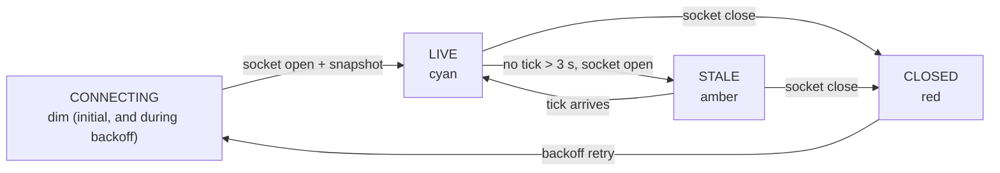

# S8 — Sync hardening (FR-5)

Issue: #11. Closes via the story PR. Depends on S2 (upgrades its fixed retry).

## Purpose

Make the sync layer honest under failure: exponential backoff, a stale-feed
indicator driven by tick age, and the event log with its slide-up drawer, so
the two-tab demo is clean and degradation is visible instead of silent.

## Design

- Reconnect: replace the fixed 2 s retry with exponential backoff (1, 2, 4, 8,
  capped 15 s) plus small jitter. Every recovery rehydrates via snapshot (S1
  contract, already true).
- Stale detection: a 1 s interval compares now against `lastTickMs`. Over 3 s
  without a tick with the socket open flips FEED to STALE (amber); socket
  closed remains CLOSED (red). Fresh tick returns LIVE.
- Event log: the second ruled slide-out. A one-line ticker pinned bottom-left
  shows the latest event; clicking slides up the full log (glass panel,
  newest first, kind-colored per token semantics: BREACH red, SENTINEL cyan,
  ZONE and FEED dim).
- Connection transitions themselves append client-side FEED events (connected,
  lost, recovered) so the log tells the sync story too.

## Interfaces

No new wire messages or endpoints; S8 consumes `event` messages (S1 contract)
and upgrades client connection behavior.

### Flowchart - Feed State

## Decisions

Story-local decisions are numbered for citation from code (S8#dN).
- d1: Stale is measured by tick age, not socket state: a wedged server with an
  open socket is the exact failure a socket-state indicator misses.
- d2: Backoff caps at 15 s: an operator console should keep trying visibly, not
  give up quietly.
- d3: The event drawer reuses the inspector's glass mechanics (same tokens, same
  slide behavior) rather than inventing a second panel language.
- d4 (build): connect attempts carry a 5 s timeout — a half-open upgrade
  neither opens nor closes, and onclose drives the retry loop, so a hung
  socket would park FEED in CONNECTING forever.
- d5 (build): dev connects the socket directly to :3001 — Vite's ws proxy
  wedges permanently after a backend restart (every upgrade errors until Vite
  itself restarts), which would fail FR-5's kill-and-recover acceptance.
  Production keeps the same-origin path; REST stays proxied (D7 parity).
- d6 (build): client-minted FEED events survive snapshot rehydration by merge:
  a restarted server's snapshot carries no history, and wholesale replacement
  erased the exact lost/recovered story the log exists to tell.

## Acceptance

- All FR-5 acceptance criteria, now including backoff and the stale indicator.
- Kill the server: CLOSED within a second. Restart: LIVE with full state, no
  refresh, backoff visible in the log timestamps.
- Two-tab demo: zones, patrol, drone, events identical across tabs; selection
  independent.
- Ticker shows the latest event; drawer slides up to the full kind-colored log.

## Review

### Gate Note

Self-served under the wrap-up ruling (see S5 doc); async PR comments still
override.

### Build Verification

Kill/restore drill (decoupled dev processes; the harness couples Vite to the
server's lifetime): kill at 21:52:07 flipped FEED to CLOSED within a second;
restore at 21:52:18 reconnected within the backoff cap, LIVE with 120 tracks
rehydrated, no refresh. The prior run captured "feed lost" in the log; this
run proved a client-minted event surviving the rehydrating snapshot (S8#d6).
Three real findings during the drill, recorded as S8#d4, d5, d6. Event
drawer renders kind-colored newest-first with the one-line ticker. STALE
path (open socket, no ticks over 3 s) implemented but not exercised live: it
requires a wedged-but-open server, which nothing in the dev stack can
simulate honestly.

### Codex Review (PR #24) - Disposition

Codex P1, confirmed real: the stale timer's lastTickReceivedMs guard meant a
server that completes the handshake but never ticks displayed LIVE forever,
which is precisely the open-but-not-updating failure S8#d1 exists to catch.
The clock is now seeded at socket open, so a tickless connection goes STALE
within the window; the guard is removed.
